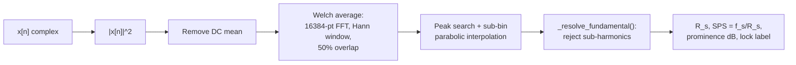
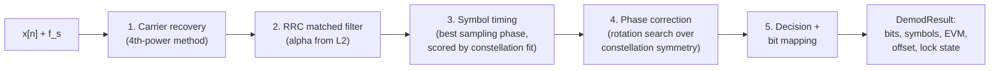
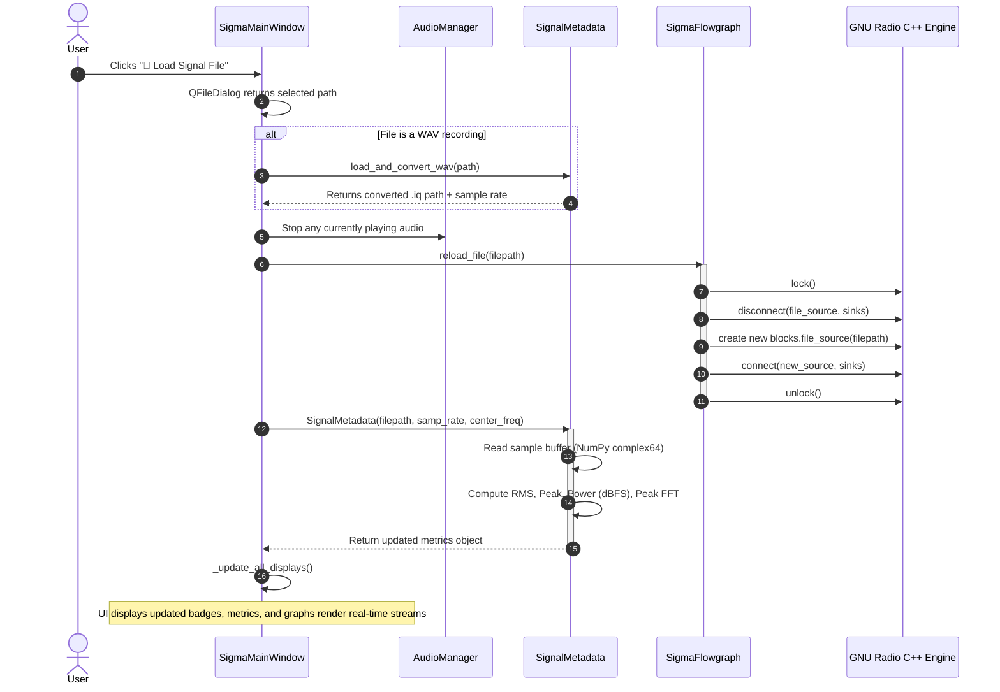

# System Architecture — SIGMA

**SIGMA** (**S**ignal **I**ntelligence & **G**eneralized **M**odulation **A**nalyzer) is structured as a modular, decoupled desktop application designed for real-time RF signal processing, signal intelligence (SIGINT), and modulation inspection.

This document details the architectural layers, module interactions, data flow, threading model, and operational lifecycle of the system.

---

## 1. High-Level Architecture

The SIGMA application is split into four primary architectural tiers:

```mermaid
graph TD
    subgraph PresentationTier ["1. Presentation Tier (PyQt5 & Custom Theme)"]
        MW["SigmaMainWindow (src/sigma_main_window.py)"]
        TH["Theme Engine (src/sigma_theme.py)"]
        SD["SettingsDialog (src/sigma_main_window.py)"]
        AM["AudioManager (src/sigma_main_window.py)"]
    end

    subgraph CoreAnalysisTier ["2. Core Analysis & Metrics Tier"]
        SM["SignalMetadata (src/sigma_analyzer_core.py)"]
        SR["Symbol Rate Estimator (src/sigma_symbol_rate.py)"]
        DM["Digital Demodulator (src/sigma_demod.py)"]
        WAV["WAV/IQ Converter (load_and_convert_wav)"]
        NP["NumPy Vectorized DSP Core"]
    end

    subgraph FlowgraphTier ["3. Flowgraph & Streaming Tier (GNU Radio)"]
        FG["SigmaFlowgraph (src/sigma_flowgraph.py)"]
        FS["blocks.file_source"]
        TS["qtgui.time_sink_c"]
        FREQ["qtgui.freq_sink_c"]
        CS["qtgui.const_sink_c"]
    end

    subgraph DataStorageTier ["4. File & Audio Storage Tier"]
        IQ["Binary IQ Recordings (data/iq/*.iq)"]
        WF["Audio Recordings (data/audio/*.wav)"]
        PW["Playback Temp WAV Cache (*_playback.wav / *_audio_preview.wav)"]
    end

    MW -->|Loads file & settings| SM
    MW -->|Controls| FG
    MW -->|Trigger audio| AM
    MW -->|Applies QSS| TH
    MW -->|Invokes| SD

    SM -->|Reads samples| IQ
    SM -->|Uses| NP
    SM -->|Delegates R_s measurement| SR
    MW -->|Runs demodulation| DM
    SR -->|R_s + SPS + lock label| MW
    MW -->|Gates stages 4/5 on lock quality| DM
    DM -->|bits, symbols, EVM| MW
    WAV -->|Converts WAV to| IQ

    FG -->|Streams from| FS
    FS -->|Reads binary| IQ
    FS --> TS
    FS --> FREQ
    FS --> CS

    TS -->|sip.wrapinstance| MW
    FREQ -->|sip.wrapinstance| MW
    CS -->|sip.wrapinstance| MW

    AM -->|Generates envelope preview| PW
    AM -->|Direct / Winsound Playback| WF
```



---

## 2. Component Breakdown

### 2.1 Entry Point (`run.py` & `src/sigma_iq_analyzer.py`)
- **`run.py`** (recommended): Root launcher that adds `src/` to `sys.path` and delegates to `src/sigma_iq_analyzer.py`.
- **`src/sigma_iq_analyzer.py`**: Initializes `QtWidgets.QApplication`, registers POSIX/Windows OS signal handlers (`SIGINT`, `SIGTERM`) for clean process termination, runs a 500 ms `QTimer` heartbeat to allow Python's signal handler to interrupt execution on `Ctrl+C`, instantiates and displays `SigmaMainWindow`.

### 2.2 Presentation Layer (`src/sigma_main_window.py` & `src/sigma_theme.py`)
The user interface implements Google Stitch / Material Design 3 dark mode aesthetics:
- **`SigmaMainWindow`**:
  - Organizes the top-level window layout into:
    1. **Header**: Brand identity, settings modal trigger.
    2. **Input Bar**: Current file name, metadata chips (Format, Sample Count, Sample Rate, Duration/Filesize), and quick-action buttons ("📂 Load Signal File", "🔊 Play Audio").
    3. **Visualizations**: Multi-view visualization suite hosting four embedded GNU Radio QtGUI sinks in a resizable `QSplitter`:
       - **Time Domain**: Oscilloscope wave plot (I in cyan, Q in magenta).
       - **Frequency Spectrum**: 1024-point FFT with Blackman-Harris windowing.
       - **Waterfall (Spectrogram)**: Time-frequency intensity waterfall display.
       - **Constellation Diagram**: Balanced aspect ratio IQ scatter plot for symbol decoding.
    4. **View Mode Switcher**: Five quick-toggle buttons (`⊞ 2x2 Grid`, `⏱ Time`, `📊 Spectrum`, `🌊 Waterfall`, `✦ Constellation`) that show/hide individual plot cards, enabling full-resolution single-sink deep inspection.
    5. **Interactive HUD Overlay**: Each plot card hosts a `QwtPlotZoomer` event bridge. Cursor clicks and drags update an overlay `QLabel` badge with live coordinate readouts (time in µs/ms, frequency in kHz/MHz, amplitude dB, or I/Q values). Right-click unzooms and resets the hint text.
    6. **Results Section**: 3-row metric grid of real-time DSP physical metrics — row 1 (Peak Frequency, Center Frequency, 99% Occupied Bandwidth, Signal Power dBFS), row 2 (Noise Floor, SNR dB, RMS Amplitude, Peak Amplitude), row 3 (**Symbol Rate**, **Samples per Symbol**, **Symbol Rate Lock**) — plus a dedicated **Modulation Classifier** panel.
    7. **Pipeline Stepper**: Horizontal status tracker marking completed and pending stages:
       `1. INPUT ✓` → `2. ANALYSIS ✓` → `3. MODULATION ✓` → `4. DEMOD` → `5. BITS`.
       Stages 4 and 5 are driven by `_run_demod_stage()`, which calls the real demodulator and **gates promotion on symbol-rate lock quality** — see §2.8.
    8. **Demodulation & Bitstream Card**: a full-width readout of the Stage 4/5 result — state (`LOCKED` / `DECLINED` / `NO CLOCK` / `UNSUPPORTED`), the method used, symbol/bit counts, EVM, recovered carrier offset, the `SPS` actually used, and the leading 48 recovered bits. When the stage declines, the card shows the measured reason and leaves the bitstream as `--`. The live `DemodResult` is also kept on `self.demod_result` for inspection.
    9. **Startup File Selection**: `resolve_sample_path()` chooses the file the app opens on, preferring a capture the *entire* pipeline can complete (`data/iq/demo_bpsk_100ksps_1msps.iq`) over the synthetic `signal.iq`, which has no recoverable symbol clock. An explicitly supplied path always wins, so the refusal path stays reproducible on demand.

### 2.6 Symbol Rate Estimation (`src/sigma_symbol_rate.py`)

A pulse-shaped digital signal is **cyclostationary**: the pulse-shaping filter
leaves an amplitude ripple that repeats once per symbol, so the envelope
`|x[n]|²` carries a periodic component at exactly `R_s`. That appears as a
spectral line in the FFT of the envelope.



Two details are load-bearing and both were found by measurement:

1. **Welch averaging is mandatory.** A single FFT of a noise-like sequence has
   ~100% spectral variance, so one noise bin readily outranks the real clock line.
2. **The FFT must be long.** At `nfft=1024` @ 1 Msps the bins are ~976 Hz wide and
   the clock line drowns in the signal's own leakage. Moving to `nfft=16384`
   took the error from **±42% → 0.00%**.

Output carries an explicit confidence label (`HIGH` / `MEDIUM` / `LOW`) derived
from peak prominence over the local noise floor. A low-alpha envelope spectrum
is nearly flat; in that regime the estimator reports `no lock` rather than a
plausible-looking wrong number.

### 2.7 Digital Demodulation (`src/sigma_demod.py`)



- **Carrier recovery** — raising to the M-th power strips the PSK modulation,
  leaving a carrier line at `M × Δf`. `x²` vs `x⁴` line prominence also reveals
  the PSK order.
- **Timing** — the best sampling phase is chosen by how tightly symbols cluster
  on the constellation, *not* by envelope amplitude.
- **Phase correction** — a rotation search over the allowed symmetry rotations
  (BPSK 180°, QPSK 90°) replaces an earlier `xⁿ` mean-phase method that left a
  −41.5° residual and cost a constant 50% BER.
- **Refusal** — `DemodResult.locked` is `False` when the input is unusable,
  with a `reason` string. `EVM` acts as a quality guard.

**Verified: 46/46 configurations at exactly 100.00% bit accuracy, BER 0.0000**,
using the *detected* symbol rate rather than the true one. See
[`VERIFICATION.md`](VERIFICATION.md).

### 2.8 Pipeline Gating (`_run_demod_stage()` in `sigma_main_window.py`)

Stages 4 and 5 are promoted only when the symbol-rate lock is at least `MEDIUM`:

```python
if not sr or not sr.get("locked"):
    self.lbl_demod.setToolTip("No symbol rate lock, so there is no clock to sample at.")
    return
if sr.get("confidence_label") == "LOW":
    self.lbl_demod.setToolTip(
        f"Symbol rate lock is only LOW ({sr['prominence_db']:.1f} dB over the noise "
        f"floor), so the bitstream would be sampled on an untrusted clock. Declined.")
    return
```

This is a deliberate design decision, not a missing feature. A bitstream
sampled on a clock that is not trusted is **plausible and wrong**, which is a
worse outcome for an intelligence tool than an explicit refusal with a reason.

#### Choosing the demodulator: let the lock decide, not a string test

The classifier can return a label naming two possibilities — `"BPSK / 2-FSK"`
is produced when `amp_std < 0.12 and f_std > 0.4`, the signature of constant
envelope plus high phase variance after differencing. That is exactly what a
BPSK demodulator resolves, so refusing it would reject a file the classifier
just measured as *possibly BPSK*. Instead the gate picks the PSK reading and
lets the demodulator's own lock be the arbiter:

```python
mod = m.modulation_class or ""
if "QPSK" in mod:        label = "QPSK"
elif "BPSK" in mod:      label = "BPSK"
elif "PSK" in mod:       # "Digital PSK/FSK", "8PSK" — not sliceable
    self._reset_demod_panel("UNSUPPORTED", reason); return
else:                    # CW, AM/ASK, unknown
    self._reset_demod_panel("UNSUPPORTED", reason); return
```

`QPSK` is tested first because a combined label could name both and `"QPSK"`
contains no substring `"BPSK"`. Only a genuinely different constellation order
(8PSK) or a non-PSK class (CW, AM/ASK) is refused up front.

A false positive here is harmless: a BPSK reading of a 2-FSK signal simply
fails to lock and the stage declines *with its own measured reason*, which is
strictly more informative than a string match refusing it. Verified by
`scratch/verify_demod_gate.py` over an 8-label matrix: BPSK, `BPSK / 2-FSK`,
QPSK and `QPSK / 8PSK` lock; 8PSK, `Digital PSK/FSK`, AM/ASK and CW decline.
- **`AudioManager`**:
  - Handles both direct WAV playback and multi-mode IQ audio demodulation (see §2.5).
- **`SettingsDialog`**:
  - Allows dynamic on-the-fly adjustment of the hardware sample rate (`samp_rate`) and center frequency (`center_freq`).
- **`sigma_theme.py`**:
  - Houses the complete color palette (`COLORS`) including dark slate backgrounds (`#0d1117`), container cards (`#161b24`), Google Sky Blue accents (`#38bdf8`), and I/Q color pairs (`cyan` and `magenta/rose`).
  - Contains the unified `MAIN_QSS` Qt Style Sheet.

### 2.3 GNU Radio Flowgraph Engine (`src/sigma_flowgraph.py` & `grc/`)
Encapsulates GNU Radio's high-performance C++ streaming pipeline via `gr.top_block`:
- **`file_source`**: Reads complex 32-bit floats (`sizeof_gr_complex = 8` bytes per sample) with automatic circular loop repeating.
- **`throttle`**: Hardware rate-matching block enforcing real-time sample throughput and eliminating CPU saturation and `fread` race conditions on looping files.
- **`time_sink_c`**: Plots real-time I (In-Phase, cyan) and Q (Quadrature, magenta) channels against time. 1024-sample buffer, 20 Hz update rate.
- **`freq_sink_c`**: Computes 1024-point FFT using a **Blackman-Harris window** with frequency shift and logarithmic dB output. Averaging factor: 0.2.
- **`waterfall_sink_c`**: Computes time-frequency spectrogram heatmaps with `-140` to `+10 dB` intensity range.
- **`constellation_sink_c`**: Renders an IQ scatter diagram (I on X-axis, Q on Y-axis) for inspecting symbol constellations. Auto-scale enabled.
- **`sip.wrapinstance` Bridge**: GNU Radio C++ QtGUI widgets inherit from Qwt / Qt C++ classes. Using Riverbank SIP (`sip.wrapinstance`), the underlying C++ pointers are bridged into standard `PyQt5.QtWidgets.QWidget` instances for integration into the main window.
- **Automatic Preview Capture**: On startup and after every file load, `capture_preview(duration_sec=0.15)` starts the flowgraph briefly, letting plots paint an initial frozen frame, then calls `stop_waves()` via `QTimer`. Plots only animate live when audio is playing.
- **Thread-safe Dynamic File Reloading** (`reload_file`):
  ```python
  self.stop(); self.wait()            # Halt GNU Radio scheduler
  self.disconnect(file_source, ...)   # Sever existing file source
  self.file_source = blocks.file_source(filepath, ...)  # New source
  self.connect(new_source, throttle)  # Rewire to throttle → sinks
  self.start()                        # Resume GNU Radio scheduler
  ```

### 2.4 Physical Metrics & Metadata Core (`src/sigma_analyzer_core.py`)
Adheres to a **truth-in-metrics** philosophy where actual physical properties are computed from sample data, and uncomputed stages display clean fallback indicators (`--`):
- **File Metadata**: File existence, byte size, sample count ($N = \text{size} / 8$), and time duration ($T = N / f_s$).
- **RMS Amplitude**:
  $$A_{\text{RMS}} = \sqrt{\frac{1}{N} \sum_{n=0}^{N-1} |x[n]|^2}$$
- **Peak Amplitude**:
  $$A_{\text{peak}} = \max |x[n]|$$
- **Signal Power (dBFS)**:
  $$P_{\text{dBFS}} = 10 \log_{10} (A_{\text{RMS}}^2)$$
- **Peak Frequency Estimation**:
  Applies a Blackman window to the initial batch of samples, computes an FFT shift, and extracts the peak bin offset relative to the configured RF center frequency.
- **Symbol Rate & SPS**: Delegated to `sigma_symbol_rate.py` (§2.6). Stored on the metadata object as `symbol_rate`, `samples_per_symbol`, `symbol_rate_confidence`, and the full `symbol_rate_result` dict (consumed by the demodulation stage).
- **Modulation Classification**: Measurement-driven, in this order:
  1. `_detect_psk_order(data)` — compares 2nd- vs 4th-power carrier-line prominence, requiring a 3 dB margin. Returns 2 (BPSK), 4 (QPSK), or 0 (undetermined).
  2. Falls back to feature statistics: `amp_std` and phase-derivative `f_std` separate CW, AM/ASK, and BPSK/2-FSK.
  3. Only if the measurement is *indeterminate* is a filename token applied, and it is labelled `filename hint, unverified`.

  > [!WARNING]
  > An earlier revision returned **hardcoded confidences** (`"96.4%"`, `"94.8%"`, `"92.1%"`) whenever the filename contained `bpsk`/`qpsk`/`fm`/`rds`, and it *shadowed* the real measured statistics computed just above it. Renaming a file changed the reported modulation. This is fixed and guarded by a test: `bpsk_modulated_1msps.iq` renamed to `anonymous_capture.iq` still reports `BPSK | measured`.
- **WAV-to-IQ Converter (`load_and_convert_wav`)**:
  - Handles stereo WAV files (mapping Left channel $\to$ In-Phase $I$, Right channel $\to$ Quadrature $Q$).
  - Handles mono WAV recordings (mapping Mono $\to$ Real baseband with $0j$ imaginary component).
  - Normalizes integer PCM ($16\text{-bit} \to [-1.0, 1.0]$) and writes an IEEE 754 `complex64` binary file.

> [!NOTE]
> This module imports its siblings in **dual mode** (relative first, flat
> fallback) because `run.py` adds `src/` to `sys.path` and imports modules
> flat rather than as a package:
> ```python
> try:
>     from .sigma_symbol_rate import estimate_symbol_rate
> except ImportError:            # running as a flat script, as run.py does
>     from sigma_symbol_rate import estimate_symbol_rate
> ```
> A plain relative import here causes `ImportError: attempted relative import
> with no known parent package` **at application startup**.

### 2.5 Audio Subsystem (`AudioManager` in `sigma_main_window.py`)
Enables listening to both acoustic baseband files and raw RF signals:
- **Multi-Mode RF Demodulator**: Three demodulation paths, auto-selected by signal characteristics:
  1. **FM Discriminator** (strong FM/FSK, phase std dev > 0.15): Instantaneous phase difference $\angle(x[n] \cdot x^*[n-1])$.
  2. **Envelope Detector** (strong AM/ASK, amplitude std dev > 0.12): $|x[n]|$ with DC removal.
  3. **BFO Heterodyne Mixer** (digital PSK / CW): Multiplies baseband IQ by a complex 1.2 kHz tone, producing an audible pitch from phase transitions.
  - Output is a weighted blend of the dominant mode.
- **Anti-aliasing Decimation**: Samples are averaged in blocks of size `samp_rate / 44100` to suppress aliasing before resampling to exactly 44.1 kHz.
- **Short Signal Looping**: Recordings shorter than 3 seconds are tiled (up to 80×) so playback is long enough to hear.
- **Non-blocking Playback**: Employs the native Windows Multimedia API via `winsound` with `SND_ASYNC | SND_FILENAME | SND_LOOP`, preventing any UI freezes during playback.
- **Synchronized Visualization**: When audio playback begins, `start_waves(rewind=True)` is called so live plots animate in sync with the audio stream.

---

## 3. Data Flow & Signal Lifecycle

The following sequence diagram outlines what happens when a user loads a signal file into the workstation:



---

## 4. Threading & Concurrency Model

SIGMA operates across multiple concurrent execution contexts to guarantee smooth 60 FPS visualization without dropping samples:

1. **Main UI Thread (Qt Event Loop)**:
   - Executes `qapp.exec_()`.
   - Handles user mouse/keyboard input, file dialogs, settings modal, and widget repaints.
2. **GNU Radio Scheduler Threads (C++ Background Pool)**:
   - GNU Radio operates its own thread-per-block (TPB) scheduler.
   - The `blocks.file_source` thread continuously reads binary chunks into ring buffers.
   - Separate worker threads push data through Qwt plot sinks.
3. **Audio Playback Thread (Windows Multimedia Subsystem)**:
   - Managed asynchronously by Windows kernel audio driver via `winsound.SND_ASYNC`.
4. **POSIX/Windows Signal Polling**:
   - Driven by a 500 ms `QTimer` tick on the main event loop, giving Python's GIL an opportunity to invoke signal handlers for `SIGINT` (`Ctrl+C`).

---

## 5. Error Handling & Fault Isolation

- **File Source Isolation**: If an invalid or missing file path is provided, the flowgraph initializes into an idle state rather than crashing.
- **Flowgraph Mutex Protection**: File reloading wraps block reconnections between `flowgraph.lock()` and `flowgraph.unlock()`. In case of connection failure, an inner `try-except` block ensures `unlock()` is unconditionally called to avoid deadlock.
- **Safe Audio Fallbacks**: If sample data contains non-finite values (NaN/Inf) or zero energy, audio generation gracefully bails out and alerts the user without halting graph execution.
