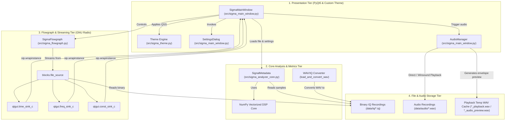
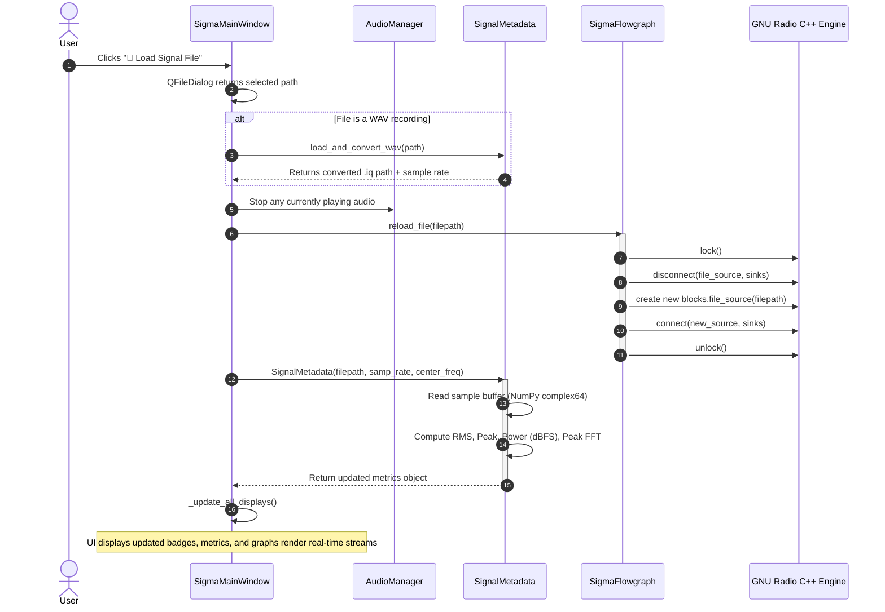

# System Architecture — SIGMA

**SIGMA** (**S**ignal **I**ntelligence & **G**eneralized **M**odulation **A**nalyzer) is structured as a modular, decoupled desktop application designed for real-time RF signal processing, signal intelligence (SIGINT), and modulation inspection.

This document details the architectural layers, module interactions, data flow, threading model, and operational lifecycle of the system.

---

## 1. High-Level Architecture

The SIGMA application is split into four primary architectural tiers:



---

## 2. Component Breakdown

### 2.1 Entry Point (`run.py` & `src/sigma_iq_analyzer.py`)
- Initializes `QtWidgets.QApplication`.
- Registers POSIX/Windows OS signal handlers (`SIGINT`, `SIGTERM`) to ensure clean process termination when closed from the terminal or IDE.
- Runs a 500 ms `QTimer` heartbeat to allow Python's signal handler to interrupt execution on `Ctrl+C`.
- Instantiates and displays `SigmaMainWindow`.

### 2.2 Presentation Layer (`src/sigma_main_window.py` & `src/sigma_theme.py`)
The user interface implements Google Stitch / Material Design 3 dark mode aesthetics:
- **`SigmaMainWindow`**:
  - Organizes the top-level window layout into:
    1. **Header**: Brand identity, dynamic status pill ("● Analyzing"), settings modal trigger.
    2. **Input Card**: Current file name, metadata chips (Format, Sample Count, Sample Rate, Total Duration/Filesize), and quick-action buttons ("📂 Load Signal File", "🔊 Play Audio").
    3. **Visualizations**: Multi-view visualization suite hosting four embedded GNU Radio QtGUI sinks:
       - **Time Domain**: Oscilloscope wave plot (I in cyan, Q in magenta).
       - **Frequency Spectrum**: 1024-point FFT with Blackman-Harris windowing.
       - **Waterfall (Spectrogram)**: Time-frequency intensity waterfall display.
       - **Constellation Diagram**: Balanced aspect ratio IQ scatter plot for symbol decoding.
       - **View Mode Switcher**: Quick-toggle buttons (`⊞ Quad View`, `⏱ Time`, `📊 Frequency`, `🌊 Waterfall`, `⭕ Constellation`) allowing dynamic toggling between 2x2 multi-sink monitoring and full-resolution single-sink deep inspection.
    4. **Results Section**: Real-time DSP physical metrics (Peak Frequency, Center Frequency, 99% Occupied Bandwidth, Signal Power dBFS, Noise Floor, SNR dB) and dedicated **Modulation Classifier** with confidence score.
    5. **Pipeline Stepper**: Horizontal status tracker visually marking the 5 stages of signal intelligence:
       `1. INPUT ✓` → `2. ANALYSIS ✓` → `3. MODULATION ✓` → `4. DEMOD ○` → `5. BITS ○`.
- **`SettingsDialog`**:
  - Allows dynamic on-the-fly adjustment of the hardware sample rate (`samp_rate`) and center frequency (`center_freq`).
- **`sigma_theme.py`**:
  - Houses the complete color palette (`COLORS`) including dark slate backgrounds (`#0d1117`), container cards (`#161b24`), Google Sky Blue accents (`#38bdf8`), and In-Phase/Quadrature color pairs (`cyan` and `magenta/rose`).
  - Contains the unified `BIG_MATERIAL_QSS` Qt Style Sheet.

### 2.3 GNU Radio Flowgraph Engine (`src/sigma_flowgraph.py` & `grc/`)
Encapsulates GNU Radio's high-performance C++ streaming pipeline via `gr.top_block`:
- **`file_source`**: Reads complex 32-bit floats (`sizeof_gr_complex = 8` bytes per sample). Configured with automatic circular loop repeating.
- **`throttle`**: Hardware rate-matching block enforcing real-time sample throughput and eliminating CPU saturation and `fread` race conditions.
- **`time_sink_c`**: Plots real-time I (In-Phase, cyan) and Q (Quadrature, magenta) channels against time.
- **`freq_sink_c`**: Computes 1024-point FFT using a **Blackman-Harris window** with frequency shift and logarithmic dB relative gain output.
- **`waterfall_sink_c`**: Computes time-frequency spectrogram heatmaps with adjustable intensity dynamic range.
- **`constellation_sink_c`**: Renders an IQ scatter diagram (I on X-axis, Q on Y-axis) for inspecting symbol constellations.
- **`sip.wrapinstance` Bridge**: GNU Radio C++ QtGUI widgets inherit from Qwt / Qt C++ classes. Using Riverbank SIP (`sip.wrapinstance`), the underlying C++ pointers are bridged cleanly into standard `PyQt5.QtWidgets.QWidget` instances for integration into the main window.
- **Thread-safe Dynamic File Reloading**:
  ```python
  self.lock()          # Halts GNU Radio scheduler execution
  self.disconnect(...) # Sever existing file source
  # Instantiate new blocks.file_source
  self.connect(...)    # Wire new block to sinks
  self.unlock()        # Resume GNU Radio scheduler
  ```

### 2.4 Physical Metrics & Metadata Core (`src/sigma_analyzer_core.py`)
Adheres to a **truth-in-metrics** philosophy where actual physical properties are computed from sample data, and uncomputed stages display clean fallback indicators (`--`):
- **File Metadata**: File existence, byte size, sample count ($N = \text{size} / 8$), and time duration ($T = N / f_s$).
- **RMS Amplitude**:
  $$A_{\text{RMS}} = \sqrt{\frac{1}{N} \sum_{n=0}^{N-1} |x[n]|^2}$$
- **Peak Amplitude**:
  $$A_{\text{peak}} = \max |x[n]|$$
- **Signal Power (dBFS)**:
  $$P_{\text{dBFS}} = 10 \log_{10} (A_{\text{RMS}}^2)$$
- **Peak Frequency Estimation**:
  Applies a Blackman window to the initial batch of samples, computes an FFT shift, and extracts the peak bin offset relative to the configured RF center frequency.
- **WAV-to-IQ Converter (`load_and_convert_wav`)**:
  - Handles stereo WAV files (mapping Left channel $\to$ In-Phase $I$, Right channel $\to$ Quadrature $Q$).
  - Handles mono WAV recordings (mapping Mono $\to$ Real baseband with $0j$ imaginary component).
  - Normalizes integer PCM ($16\text{-bit} \to [-1.0, 1.0]$) and writes an IEEE 754 `complex64` binary file.

### 2.5 Audio Subsystem (`AudioManager` in `sigma_main_window.py`)
Enables listening to both acoustic baseband files and raw RF signals:
- **RF Envelope Demodulator**: Computes the complex magnitude envelope $|x[n]|$, strips DC bias, normalizes peak amplitude, decimates the sample rate to $44.1\text{ kHz}$, and synthesizes standard 16-bit PCM WAV audio.
- **Non-blocking Playback**: Employs the native Windows Multimedia API via Python's `winsound` with `SND_ASYNC` and `SND_FILENAME`, preventing any UI freezes during playback.

---

## 3. Data Flow & Signal Lifecycle

The following sequence diagram outlines what happens when a user loads a signal file into the workstation:



---

## 4. Threading & Concurrency Model

SIGMA operates across multiple concurrent execution contexts to guarantee smooth 60 FPS visualization without dropping samples:

1. **Main UI Thread (Qt Event Loop)**:
   - Executes `qapp.exec_()`.
   - Handles user mouse/keyboard input, file dialogs, settings modal, and widget repaints.
2. **GNU Radio Scheduler Threads (C++ Background Pool)**:
   - GNU Radio operates its own thread-per-block (TPB) scheduler.
   - The `blocks.file_source` thread continuously reads binary chunks into ring buffers.
   - Separate worker threads push data through Qwt plot sinks.
3. **Audio Playback Thread (Windows Multimedia Subsystem)**:
   - Managed asynchronously by Windows kernel audio driver via `winsound.SND_ASYNC`.
4. **POSIX/Windows Signal Polling**:
   - Driven by a 500 ms `QTimer` tick on the main event loop, giving Python's GIL an opportunity to invoke signal handlers for `SIGINT` (`Ctrl+C`).

---

## 5. Error Handling & Fault Isolation

- **File Source Isolation**: If an invalid or missing file path is provided, the flowgraph initializes into an idle state rather than crashing.
- **Flowgraph Mutex Protection**: File reloading wraps block reconnections between `flowgraph.lock()` and `flowgraph.unlock()`. In case of connection failure, an inner `try-except` block ensures `unlock()` is unconditionally called to avoid deadlock.
- **Safe Audio Fallbacks**: If sample data contains non-finite values (NaN/Inf) or zero energy, audio generation gracefully bails out and alerts the user without halting graph execution.
