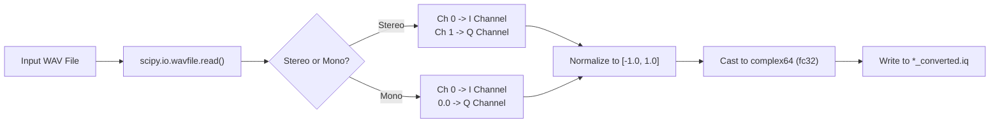
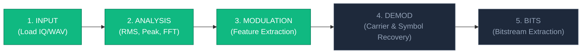

# Data Pipeline & Signal Formats

This document describes the signal mathematical foundations, binary storage standards, conversion algorithms, and DSP pipelines implemented within **SIGMA**.

---

## 1. I/Q Signal Representation (Mathematical Foundation)

In Radio Frequency (RF) engineering and Software Defined Radio (SDR), signals are typically represented in complex baseband form using **In-Phase ($I$)** and **Quadrature ($Q$)** components:

$$s(t) = I(t) + j Q(t)$$

Where:
- $I(t)$ is the real part (in-phase with the local oscillator: $\cos(2\pi f_c t)$).
- $Q(t)$ is the imaginary part (shifted by $90^\circ$: $-\sin(2\pi f_c t)$).
- $j = \sqrt{-1}$.

From these two orthogonal components, all fundamental physical properties can be derived instantaneously:

| Measurement | Formula | Description |
| :--- | :--- | :--- |
| **Instantaneous Amplitude (Envelope)** | $A(t) = \sqrt{I(t)^2 + Q(t)^2}$ | Represents signal power and envelope. |
| **Instantaneous Phase** | $\theta(t) = \arctan2(Q(t), I(t))$ | Tracks phase modulation (PSK). |
| **Instantaneous Frequency** | $f(t) = \frac{1}{2\pi} \frac{d\theta(t)}{dt}$ | Tracks frequency shifts (FSK/FM). |

---

## 2. Binary File Storage: The `.iq` Format

SIGMA's primary data interchange standard is the **Raw Complex Float32 (`complex64`)** binary format.

### Memory Layout
Each complex sample consists of two consecutive 32-bit (4-byte) single-precision IEEE 754 floating-point numbers stored in Little-Endian byte order:

```
Byte Offset:   0       1       2       3       4       5       6       7
Content:     [    In-Phase (I) float32   ]   [   Quadrature (Q) float32  ]
             <---------- 4 Bytes --------->   <---------- 4 Bytes --------->
             <----------------------- 8 Bytes Total ----------------------->
```

### Key Metrics Computation
Given an IQ file with file size $S$ bytes and configured sample rate $f_s$ samples/sec:
- **Total Samples ($N$)**:
  $$N = \frac{S}{8}$$
- **Signal Duration ($T$)**:
  $$T = \frac{N}{f_s} \text{ seconds}$$

---

## 3. WAV-to-IQ Ingestion Pipeline

SIGMA allows users to load standard `.wav` audio files and converts them into `.iq` files via `load_and_convert_wav()` in `sigma_analyzer_core.py`:



### Stereo vs Mono Processing:
1. **Stereo WAV (SDR Recorders)**:
   - Many software receivers (e.g. SDR#, HDSDR) export IQ signals as 2-channel stereo WAV files.
   - Channel 0 is mapped to $I$, Channel 1 is mapped to $Q$.
   - The resulting signal represents a full complex spectrum.
2. **Mono WAV (Acoustic / Baseband)**:
   - Mapped to real baseband: $s[n] = x_{\text{mono}}[n] + 0j$.

---

## 4. Audio Preview Generation Algorithm

To enable instant listening of RF recordings without external demodulators, `AudioManager._convert_iq_to_audio_wav()` uses a **multi-mode demodulator** that auto-selects based on signal characteristics:

```
[Raw IQ Buffer (up to 1,000,000 samples)]
       │
       ▼
[Tile / Loop]                 --> If duration < 3.0 s, repeat samples up to 80× to ensure audible playback
       │
       ▼
[Anti-aliasing Decimate]      --> Average blocks of size samp_rate/44100 → initial audio rate
       │
       ├──────────────────────────────────────────────────────┐
       ▼                                                      ▼
[FM Discriminator]                                   [BFO Heterodyne Mixer]
angle(x[n] * conj(x[n-1]))                          x[n] * exp(j·2π·1200·t)
       │                                                      │
       ▼                                                      ▼
[Envelope Detector]                                  [real(heterodyne)]
np.abs(x[n]) - DC                                            │
       │                                                      │
       └─────────── Weighted Blend (by signal type) ─────────┘
                           │
                           ▼
            FM std > 0.15  →  75% FM + 25% BFO
            Amp std > 0.12  →  75% Envelope + 25% BFO
            Otherwise       →  100% BFO (PSK / CW)
                           │
                           ▼
[Normalize to ±0.88]      --> Peak normalization to prevent clipping
                           │
                           ▼
[Resample to 44100 Hz]    --> Linear interpolation to exact 44.1 kHz
                           │
                           ▼
[audio * 32767 as int16]  --> Quantization to 16-bit signed PCM
                           │
                           ▼
[*_audible.wav]           --> Export temporary WAV file
                           │
                           ▼
[winsound.PlaySound(..., SND_ASYNC | SND_LOOP)] --> Non-blocking looping Windows audio playback
```

---

## 5. End-to-End Signal Intelligence Pipeline

SIGMA's workflow represents the standard 5-step SIGINT pipeline displayed on the application's bottom status bar:



1. **Input** ✅: File ingestion, format detection (`complex64` IQ or WAV), sample count calculation, WAV-to-IQ conversion.
2. **Analysis** ✅: Time/frequency/constellation/waterfall visual rendering, RMS voltage, peak amplitude, peak frequency estimation, 99% OBW, noise floor, and SNR.
3. **Modulation** ✅: Feature extraction (instantaneous phase variance, amplitude variance) and classification of candidate modulations (AM, FM, ASK, FSK, BPSK, QPSK, 8PSK, QAM, CW) with confidence score.
4. **Demodulation** 🔄: Carrier recovery, symbol synchronization, and matched filtering — planned for next sprint.
5. **Bits** 🔄: Decision slicing and binary data stream extraction — planned for next sprint.
