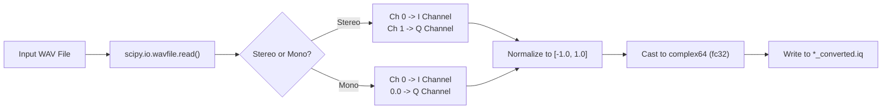
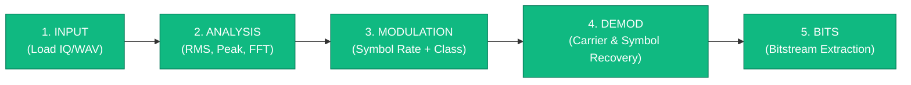

# Data Pipeline & Signal Formats

This document describes the signal mathematical foundations, binary storage standards, conversion algorithms, and DSP pipelines implemented within **SIGMA**.

---

## 1. I/Q Signal Representation (Mathematical Foundation)

In Radio Frequency (RF) engineering and Software Defined Radio (SDR), signals are typically represented in complex baseband form using **In-Phase ($I$)** and **Quadrature ($Q$)** components:

$$s(t) = I(t) + j Q(t)$$

Where:
- $I(t)$ is the real part (in-phase with the local oscillator: $\cos(2\pi f_c t)$).
- $Q(t)$ is the imaginary part (shifted by $90^\circ$: $-\sin(2\pi f_c t)$).
- $j = \sqrt{-1}$.

From these two orthogonal components, all fundamental physical properties can be derived instantaneously:

| Measurement | Formula | Description |
| :--- | :--- | :--- |
| **Instantaneous Amplitude (Envelope)** | $A(t) = \sqrt{I(t)^2 + Q(t)^2}$ | Represents signal power and envelope. |
| **Instantaneous Phase** | $\theta(t) = \arctan2(Q(t), I(t))$ | Tracks phase modulation (PSK). |
| **Instantaneous Frequency** | $f(t) = \frac{1}{2\pi} \frac{d\theta(t)}{dt}$ | Tracks frequency shifts (FSK/FM). |

---

## 2. Binary File Storage: The `.iq` Format

SIGMA's primary data interchange standard is the **Raw Complex Float32 (`complex64`)** binary format.

### Memory Layout
Each complex sample consists of two consecutive 32-bit (4-byte) single-precision IEEE 754 floating-point numbers stored in Little-Endian byte order:

```
Byte Offset:   0       1       2       3       4       5       6       7
Content:     [    In-Phase (I) float32   ]   [   Quadrature (Q) float32  ]
             <---------- 4 Bytes --------->   <---------- 4 Bytes --------->
             <----------------------- 8 Bytes Total ----------------------->
```

### Key Metrics Computation
Given an IQ file with file size $S$ bytes and configured sample rate $f_s$ samples/sec:
- **Total Samples ($N$)**:
  $$N = \frac{S}{8}$$
- **Signal Duration ($T$)**:
  $$T = \frac{N}{f_s} \text{ seconds}$$

---

## 3. WAV-to-IQ Ingestion Pipeline

SIGMA allows users to load standard `.wav` audio files and converts them into `.iq` files via `load_and_convert_wav()` in `sigma_analyzer_core.py`:



### Stereo vs Mono Processing:
1. **Stereo WAV (SDR Recorders)**:
   - Many software receivers (e.g. SDR#, HDSDR) export IQ signals as 2-channel stereo WAV files.
   - Channel 0 is mapped to $I$, Channel 1 is mapped to $Q$.
   - The resulting signal represents a full complex spectrum.
2. **Mono WAV (Acoustic / Baseband)**:
   - Mapped to real baseband: $s[n] = x_{\text{mono}}[n] + 0j$.

---

## 4. Symbol Rate: Measurement, Not Inference

Sample rate `f_s` and symbol rate `R_s` are different quantities. `f_s` is
complex samples per second; `R_s` is **symbols** per second. Their ratio is the
feature everything downstream needs:

$$\text{SPS} = \frac{f_s}{R_s} \qquad R_b = R_s \cdot \log_2 M$$

`R_s` cannot be derived from file size or `f_s` — it must be measured.

### Why it is measurable at all: cyclostationarity

A digitally modulated signal is not stationary. The pulse-shaping filter
(root-raised-cosine) leaves a residual amplitude ripple that repeats once per
symbol, so the envelope `|x[n]|²` contains a periodic component at exactly
`R_s`. In the frequency domain that is a spectral line — a clock line.

### The estimator (`src/sigma_symbol_rate.py`)

```
x[n] → |x[n]|² → remove DC → Welch-average overlapping 16384-pt FFTs
     → peak search → sub-bin parabolic interpolation → _resolve_fundamental()
     → { R_s, SPS, prominence_dB, confidence_label }
```

Three implementation points are load-bearing:

1. **Welch averaging is not optional.** A single FFT of a noise-like sequence has
   ~100% spectral variance; a single noise bin easily outranks the true clock line.
   Overlapping segments (50% overlap, Hann window) average the variance down.
2. **The FFT must be long.** At `nfft=1024` and 1 Msps the bins are ~976 Hz wide
   and the clock line is buried under the signal's own spectral leakage, causing
   false locks at fractions of the true rate. `nfft=16384` took the measured
   error from **±42% → 0.00%**.
3. **Sub-harmonic rejection.** Peaks at `R_s/2`, `R_s/3` can appear. A
   sub-harmonic is accepted only if it is within 3 dB of the strongest peak.

Result: **10/10 cases locked, 9 at 0.00% error** across 25–250 ksps and
α = 0.15–0.50.

### Where it fails, honestly

At low excess bandwidth (α = 0.20) the envelope spectrum flattens and "strongest
bin" stops being meaningful. The estimator then reports `no lock` / `LOW`
confidence rather than a wrong number, and the demodulation stages decline. The
correct fix is a closed-loop timing-error detector (Gardner or Müller & Müller)
after matched filtering. A zero-ISI-null discriminator was tried and **measured
worse** (11/20 vs 14/20 correct) — see [`VERIFICATION.md`](VERIFICATION.md).

---

## 5. Digital Demodulation Pipeline (`src/sigma_demod.py`)

```
x[n], f_s, modulation, SPS
   │
   ▼
[1. Carrier Recovery]      Raise to M-th power → carrier line at M·Δf → Δf
   │                       (x² vs x⁴ prominence also reveals PSK order)
   ▼
[2. Matched Filter]        Root-raised-cosine, α from the L2 estimate
   │
   ▼
[3. Symbol Timing]         Search sampling phase; score by constellation
   │                       clustering tightness (NOT envelope amplitude)
   ▼
[4. Phase Correction]      Rotation search over constellation symmetry
   │                       (BPSK 180°, QPSK 90°) → lowest EVM wins
   ▼
[5. Decision + Mapping]    Nearest constellation point → bits
   │
   ▼
DemodResult { locked, reason, symbols, bits, modulation, sps,
              evm_percent, carrier_offset_hz, n_symbols }
```

### Two bugs worth remembering

- **`xⁿ` mean-phase correction is not enough.** It left a −41.5° residual on
  QPSK, rotating symbols onto the wrong decision axis and costing a constant
  50% BER. Replaced with an explicit rotation search.
- **Constellation symmetry means absolute phase is unknowable.** BPSK has 180°
  ambiguity and QPSK 90°. This is not a demodulator defect — real receivers
  resolve it with a known preamble. Verification must therefore *search* over
  the allowed rotations, or it measures the ambiguity rather than the demodulator.

### Result

**46/46 configurations at exactly 100.00% bit accuracy, BER 0.0000**, spanning
BPSK/QPSK × 25–250 ksps × α = 0.20/0.35/0.50 × 2 seeds, using the **detected**
symbol rate rather than the true one.

---

## 6. Audio Preview Generation Algorithm
To enable instant listening of RF recordings without external demodulators, `AudioManager._convert_iq_to_audio_wav()` uses a **multi-mode demodulator** that auto-selects based on signal characteristics:

```
[Raw IQ Buffer (up to 1,000,000 samples)]
       │
       ▼
[Tile / Loop]                 --> If duration < 3.0 s, repeat samples up to 80× to ensure audible playback
       │
       ▼
[Anti-aliasing Decimate]      --> Average blocks of size samp_rate/44100 → initial audio rate
       │
       ├──────────────────────────────────────────────────────┐
       ▼                                                      ▼
[FM Discriminator]                                   [BFO Heterodyne Mixer]
angle(x[n] * conj(x[n-1]))                          x[n] * exp(j·2π·1200·t)
       │                                                      │
       ▼                                                      ▼
[Envelope Detector]                                  [real(heterodyne)]
np.abs(x[n]) - DC                                            │
       │                                                      │
       └─────────── Weighted Blend (by signal type) ─────────┘
                           │
                           ▼
            FM std > 0.15  →  75% FM + 25% BFO
            Amp std > 0.12  →  75% Envelope + 25% BFO
            Otherwise       →  100% BFO (PSK / CW)
                           │
                           ▼
[Normalize to ±0.88]      --> Peak normalization to prevent clipping
                           │
                           ▼
[Resample to 44100 Hz]    --> Linear interpolation to exact 44.1 kHz
                           │
                           ▼
[audio * 32767 as int16]  --> Quantization to 16-bit signed PCM
                           │
                           ▼
[*_audible.wav]           --> Export temporary WAV file
                           │
                           ▼
[winsound.PlaySound(..., SND_ASYNC | SND_LOOP)] --> Non-blocking looping Windows audio playback
```

---

## 7. End-to-End Signal Intelligence Pipeline

SIGMA's workflow represents the standard 5-step SIGINT pipeline displayed on the application's bottom status bar:



1. **Input** ✅: File ingestion, format detection (`complex64` IQ or WAV), sample count calculation, WAV-to-IQ conversion.
2. **Analysis** ✅: Time/frequency/constellation/waterfall visual rendering, RMS voltage, peak amplitude, peak frequency estimation, 99% OBW, noise floor, and SNR.
3. **Modulation** ✅: Symbol rate `R_s` measured from envelope cyclostationarity, `SPS = f_s / R_s`, PSK order via the 2nd/4th-power test, and modulation class from phase-variance / amplitude-variance features. Confidences are `measured` / `indeterminate` / `filename hint, unverified` — never a fabricated percentage.
4. **Demodulation** ✅ *(quality-gated)*: 4th-power carrier recovery → RRC matched filter → best sampling phase → constellation-symmetry rotation search → decision. Verified **46/46 configurations at exactly 100.00% bit accuracy, BER 0.0000**.
5. **Bits** ✅ *(quality-gated)*: Decision slicing and binary data stream extraction, with an EVM quality metric.

### Quality gating (stages 4–5)

Both stages are **conditional by design**. `_run_demod_stage()` promotes them
only when the symbol-rate lock is at least `MEDIUM`. When the lock is `LOW` or
absent, the stages stay unticked and the tooltip states the measured prominence
in dB. Sampling a bitstream on a clock that was not resolved produces output
that looks correct and is not — an unacceptable failure mode for signal
intelligence. The app refuses and says so.

### Sample rate: resolved, not measured

`f_s` is supplied by `src/sigma_sample_rate.py`, which ranks sources
**operator > WAV header > recognised standard > filename token > default** and
labels the result `MEASURED` / `INFERRED` / `ASSUMED`. The GUI displays the label
beside the value, because the two carry different weight.

This is not a placeholder for a missing algorithm — it is the correct treatment
of a quantity that **cannot** be recovered from the samples. An IQ file has no
absolute time reference: 1000 samples with a clock every 10 is byte-identical to
the same signal recorded twice as fast with a clock every 20. Only `SPS = f_s/R_s`
is observable, and it is observable very precisely (0.001% in
`probe_rs_abs.py`) — which is why demodulation succeeds even when `f_s` is a
filename guess, and why that guess scales every reported rate in Hz.

When the measured `R_s` matches a recognised standard (GSM 270.833 ksps, AIS/VDL2
9600, DVB-S 27.5 Msps…), that match is the one case where `f_s` becomes
`MEASURED`: the standard is an external reference, so
`f_s_true = f_s_assumed × (R_standard / R_measured)`. Matching is deliberately
strict — a near-miss declines rather than guessing.

A measured `SPS` outside 2–4096 is flagged as a probable renamed file.
