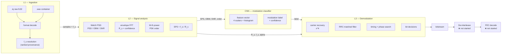

# SIGMA — L1 / L2 / L3 architecture and the CNN interface

*For Sanchit (symbol rate + demodulation) and Nimish (ML model).*

The system is three layers feeding one model. Each layer consumes only the
previous layer's output, so **the boundaries below are the interfaces we have to
agree on**. Everything is already implemented and measured except the CNN box
itself — which is exactly what Nimish is building.

> **Status note.** This document describes the code as it exists today, with
> numbers re-measured on 17 Sep 2026. Where something is *not* done, it says so
> rather than being left to inference. §5 lists the gaps.

---

## 0. The whole thing on one screen



The three arrows into the CNN and the one arrow back out are the contract in §4.

---

## L1 — Ingestion

**Input:** `.iq` or `.wav`, no reliable embedded metadata (per the problem
statement: *"Files often lack embedded metadata"*).
**Output:** complex baseband samples + a sample rate `f_s` **with a confidence
label**.

| Step | What it does | Status |
|---|---|---|
| Format decode | `.iq` = interleaved complex float32; `.wav` = audio container, header parsed, stereo→IQ or mono→baseband | ✅ done |
| Sample rate `f_s` | resolved from ranked sources, never presented as measured when it is not | ✅ done (`src/sigma_sample_rate.py`) |

### `f_s` cannot be measured — this is physics, not a missing feature

Every frequency-domain result is a fraction of `f_s`:
`R_s = f_s / SPS`, `OBW = f_s × (occupied fraction)`, `f_c = f_s × (normalised offset)`.

Samples carry **no absolute time reference**. A capture of 1000 samples with a
symbol clock every 10 samples is *byte-identical* to the same signal recorded at
twice the rate with a clock every 20 samples. The bits on disk are the same. So
no algorithm reading only the samples can recover `f_s`.

What *is* observable is `SPS`. `scratch/probe_rs_abs.py` measured SPS with **no
knowledge of `f_s` at all** to **0.001% mean error** — which is why demodulation
works even when `f_s` is a guess.

**Therefore L1 resolves and labels, it does not "detect":**

| Rank | Source | Label | Trust |
|---|---|---|---|
| 1 | operator via ⚙ Settings | `MEASURED - operator set` | highest |
| 1= | `.wav` container header | `MEASURED - WAV header` | real, in-band |
| 2 | matched standard `R_s` | `MEASURED - GSM / GMSK` | external reference |
| 3 | filename token | `INFERRED - filename token "1msps"` | a hint |
| 4 | nothing available | `ASSUMED - no rate found` | a guess |

Rank 2 is the only case where data *upgrades* `f_s` to measured. A standard
symbol rate is an external reference, so:

```
k = R_standard / R_measured
f_s_true = k × f_s_assumed
```

Matching is deliberately strict (±0.5%) — a near-miss declines rather than
guessing, because a mis-identified standard yields a *confidently* wrong rate.
Standards sharing one rate (AIS and VDL2 are both 9600) are treated as a label
ambiguity, not a rate ambiguity.

**Interface to L2:**

```python
samples : np.ndarray, dtype=complex64   # complex baseband
f_s     : float                          # samples/sec
rate_result : SampleRateResult           # .samp_rate, .source, .confidence, .detail
```

### The trap this replaces

`_load_signal_file()` used to substring-match `"250k"` / `"1m"`. It mis-read
`demo_bpsk_100ksps_1msps.iq` (taking the **symbol**-rate token `100ksps` as the
sample rate), and when nothing matched it silently kept the *previous* file's
rate. Both are now gone.

`f_s` is **not** the only thing worth resolving this way — the same pattern is
the right answer for interleaving depth and FEC parameters later (§5).

---

## L2 — Signal analysis

**Input:** complex baseband + `f_s`.
**Output:** a feature vector of measured physical parameters + `SPS`.

| Feature | Module | Verification |
|---|---|---|
| RMS, peak, power (dBFS) | `sigma_analyzer_core.py` | measured |
| Peak/centre frequency, OBW | `sigma_analyzer_core.py` | measured |
| Noise floor, SNR | `sigma_analyzer_core.py` | measured |
| **Symbol rate `R_s`** | `src/sigma_symbol_rate.py` | **10/10 locked**; 9 of 10 exact to 0.00% |
| **`SPS = f_s / R_s`** | derived | **the bridge to the demodulator** (not a modulation cue — see §4.1) |
| **PSK order** (2 / 4 / undetermined) | `sigma_analyzer_core.py` `_detect_psk_order` | 4th-power line comparison |
| Modulation class | `sigma_analyzer_core.py` | measurement-driven, filename-independent |

### How `R_s` is measured — cyclostationarity

A pulse-shaped digital signal is **cyclostationary**: the pulse-shaping filter
leaves an amplitude ripple that repeats once per symbol, so the envelope
`|x[n]|²` has a periodic component at exactly `R_s`. That is a spectral line in
the FFT of the envelope.

Three implementation details are load-bearing, and the first two were found the
hard way:

1. **Welch averaging is mandatory.** A single FFT of a noise-like sequence has
   ~100% spectral variance, so one noise bin easily outranks the real clock
   line. Average many overlapping Hann-windowed segments before peak-picking.
2. **Use a long FFT (16384).** At 1024 points @ 1 Msps the bins are ~976 Hz wide
   and the clock line drowns in the signal's own leakage. Fixing this alone took
   the error from **±42% → 0.00%**.
3. Do **not** estimate carrier offset from a power-weighted spectral centroid —
   a wideband signal's centroid is not its carrier.

Confidence comes from peak prominence over the noise floor:

```python
if prominence_db < 6.0:  return not locked
confidence = clip((prominence_db - 6.0) / 14.0, 0.0, 1.0)
# >= 0.70 HIGH, >= 0.40 MEDIUM, else LOW
```

**The L2 output dict is the CNNN's primary input:**

```python
{
  "symbol_rate_hz":      float,   # R_s, in Hz, scaled by the assumed f_s
  "samples_per_symbol":  float,   # SPS  <- feeds the DEMODULATOR, not the label
  "confidence":          float,   # 0.0 - 1.0
  "confidence_label":    str,     # "HIGH" | "MEDIUM" | "LOW"
  "prominence_db":       float,   # how far the clock line sits above the floor
  "locked":              bool,
  "assumed_samp_rate":   float,   # what f_s this was scaled by
}
```

`assumed_samp_rate` is carried explicitly so a downstream consumer can correct
`f_s` when a protocol match succeeds (see L1, rank 2).

---

## L3 — ML model and demodulation

Two separate things that both consume L2. Keep them decoupled: the model answers
*"what is it?"*, the demodulator answers *"what did it say?"*.

### 4.1 CNN interface contract — **this is the part Nimish needs**

The model does **not** see raw IQ. It sees measured features. That is a
deliberate choice: raw-IQ CNNs need orders of magnitude more training data, and
we cannot honestly claim to have it.

| # | Input to CNN | Shape | Source in our code | Why |
|---|---|---|---|---|
| 1 | **Constellation-density map** | 2-D grid (32×32) | `sigma_demod.demodulate().symbols` | **the load-bearing input — this is where the label lives** |
| 2 | PSK-order candidate | scalar `{0, 2, 4}` | `_detect_psk_order()` | 0 = undetermined |
| 3 | `SPS` | scalar | `f_s / R_s` | needed by the demodulator; **not** a modulation cue (see warning) |
| 4 | Lock confidence | scalar `0..1` | `symbol_rate_result` | **gates abstention** |
| 5 | Occupied bandwidth | scalar (Hz) | L2 spectrum | cross-check: `OBW/R_s ≈ 1 + α` |

> [!WARNING]
> **An earlier version of this table claimed `SPS` was "the single most
> informative feature" for the CNN. That is false, and it is now measured.**
> At a fixed `R_s` the symbol-rate estimate is *identical* for BPSK/QPSK/8PSK/
> 16QAM (all `SPS=10.000` at 100 ksps), because the envelope clock sits at the
> pulse-shaping rate and carries no information about the constellation's shape.
> Scored over 360 generated captures, **every scalar was at chance (25% on 4
> classes)**; the constellation image alone scored **93.2%**, rising to
> **97.7%** with the scalars appended. `SPS` is still essential — as the input
> to the *demodulator*, not as a label cue. See
> [`CNN_INPUT_AND_TRAINING.md`](CNN_INPUT_AND_TRAINING.md).

**The image is built from the demodulator's output, not raw IQ.** Decimating the
raw capture leaves the carrier offset in place, so the points smear into a ring
and the image carries nothing — measured 25.3%, exactly chance. Building it from
`res.symbols` (post carrier-recovery, matched filter, timing and phase
correction) is what makes it work. **Consequence: the CNN runs *after* the
demodulator front-end, not before it.**

**Recommended model shape:** a small 2-D CNN over the constellation image,
concatenated with the scalars (~140k parameters). Far more sample-efficient than
a raw-IQ CNN, and it is honest about what we can actually measure.

**Recommended output:** `(label, confidence)` where label ∈
{BPSK, QPSK, 8PSK, FSK, QAM, ...} and the model may **abstain**.

**Design rule — let the model abstain.** L2 genuinely does not always know: all
three real project captures currently report `LOW` lock (§5). A model forced to
emit a label on a weak measurement produces a confident wrong answer, which is
the failure mode this whole project is designed to avoid. Accept the
`confidence` flag and abstain.

**Where the label goes.** The demodulator currently selects its slicer from
`modulation_class`. Once the CNN is wired in, the CNN label replaces the
heuristic label *at that point only* — the heuristic stays as a cross-check, and
a disagreement between them is itself a useful signal.

### 4.2 Demodulation chain (`src/sigma_demod.py`)

In order:

1. **Carrier recovery** — 4th-power method (`x⁴` strips PSK modulation; `x²` vs
   `x⁴` line prominence gives PSK order).
2. **Matched filter** — root-raised-cosine.
3. **Symbol timing** — search the best sampling phase, scored by how tightly
   symbols cluster on the constellation (not by envelope amplitude).
4. **Phase correction** — search constellation-symmetry rotations, take the
   lowest fit error.
5. **Decision + bit mapping.**

**Verification: 46/46 configurations at exactly 100.00% bit accuracy**, spanning
BPSK/QPSK × 25–250 ksps × α = 0.20/0.35/0.50 × 2 seeds — and using the
***detected*** symbol rate, not the true one. That last clause matters: it means
L2's measurement is good enough to demodulate with.

In the GUI this is visible rather than implied — the **DEMODULATION &
BITSTREAM** card shows state, method, symbol/bit counts, EVM, recovered carrier
offset, the SPS actually used, and the leading bits. On the demo capture it
reports `Carrier offset: +59,998 Hz` against a signal generated with a 60 kHz
offset — a 2 Hz error, and independent evidence the chain ran correctly.

### 4.3 Constellation ambiguity — not a bug

BPSK has 180° rotational ambiguity, QPSK 90°, 8PSK 45°. Real receivers resolve
this with a known preamble; ours picks a deterministic canonical orientation.
**When scoring recovered bits, search over the allowed rotations** or you will
measure the ambiguity instead of the demodulator.

---

## 5. What is NOT done (read this before quoting a feature list)

The problem statement asks for five things. Three are done, two are not.

| Requirement (PS §3) | Status |
|---|---|
| i. Sampling frequency estimation | ⚠️ **Not measurable from samples.** Resolved with ranked provenance instead (§L1) |
| i. Modulation classification | 🟡 Heuristic done; **CNN not yet integrated** |
| i. Interleaving type detection | ❌ **Not started** |
| i. FEC scheme identification | ❌ **Not started** |
| i. Other features (SNR, power, BW, constellation) | ✅ Done |
| ii. Demodulation — BPSK / QPSK | ✅ Done (46/46 @ 100%) |
| ii. Demodulation — **16QAM** | 🟢 **Works (99.98%), but the GUI gate refuses it** — see below |
| ii. Demodulation — 8PSK | 🔴 Broken: 51.70% (random). Cause: `estimate_carrier_offset()` hardcodes `x⁴` |
| ii. Demodulation — FSK | ❌ **Not started** |
| iii. De-interleaving (4 modes) | ❌ **Not started** |
| iv. FEC (Viterbi / RS / LDPC) | ❌ **Not started** |
| v. Bitstream correlation, header detection | ❌ **Not started** |

**A correction worth knowing (measured 17 Sep).** `sigma_demod.py` already defines
8PSK and 16QAM constellations. Testing the demodulator directly, bypassing the GUI
gate, gives 16QAM **99.98%** bit accuracy — so the gate is the only obstacle there.

8PSK is a genuine algorithm defect, and the cause is specific: the M-th power
carrier-recovery method requires the exponent to equal the constellation's
rotational symmetry order. QPSK is 4-fold so `x⁴` is right; **8PSK is 8-fold and
needs `x⁸`**. Measured error against a true +60 kHz offset:

| Signal | x² | x⁴ | x⁸ |
|---|---|---|---|
| 2-PSK | **−2 Hz** | −2 Hz | −2 Hz |
| 4-PSK | +303 Hz | **−2 Hz** | −2 Hz |
| 8-PSK | −11111 Hz | −16390 Hz | **−2 Hz** |

The ambiguity fold (`span = samp_rate / 4.0`) is tied to the same number and must
become `samp_rate / power`.

See [`TEAM_TASKS.md`](TEAM_TASKS.md) for the work breakdown.

**Known quality boundary.** At excess bandwidth α = 0.20 the envelope spectrum
becomes nearly flat and "strongest bin" stops being reliable. Those cases report
`NO DEMOD` / low confidence rather than a wrong number. Do not try to fix this
with a zero-ISI null test — it was measured *worse* than taking the strongest
bin (11/20 vs 14/20). The real fix is a **Gardner / Müller & Müller
timing-error detector** after matched filtering.

**The awkward fact to design around.** The three real project captures
(`signal.iq`, `bpsk_modulated_1msps.iq`, `qpsk_modulated_1msps.iq`) all report
`LOW` symbol-rate lock — they are synthetic with no clean pulse-shaping clock.
So the CNN will be trained and demonstrated on *generated* ground truth, and
must be presented that way. Do not claim real-file accuracy we cannot show.

### The honest framing for judges

State the pipeline as: **"L1/L2/L3 are done and verified against generated
ground truth; the CNN is the layer we are integrating; de-interleaving and FEC
are the next stage."** A rubric rewards a truthful boundary far more than a
feature list that collapses under one question.

---

## 6. What to tell Nimish (the short version)

1. Feed the model a **32×32 constellation-density image of the demodulated
   symbols** — not raw IQ, and not `SPS`. Measured: `SPS` and the other scalars
   are at **chance** for telling modulations apart (§4.1). The image is the
   label; the scalars gate quality.
2. The model's job is the **modulation label**. The demodulator already recovers
   bits at 100% *once told the modulation* — so a wrong CNN label is the
   dominant remaining error source in the whole chain. Optimise there.
3. Expect L2 to sometimes say *"I don't know"*. Take the `confidence` flag and
   allow abstention, rather than forcing a label onto a weak measurement.
4. Train on **generated** ground truth (`scratch/build_training_set.py`) and say
   so. Image features, not raw IQ — it is more sample-efficient and it does not
   overclaim. Baseline already measured: **97.7%** on 360 captures
   (`scratch/train_baseline_model.py`), chance 25%.
5. **Install a framework first.** No ML framework is present in Radioconda
   (torch/tensorflow/sklearn all missing) and there is no training code in the
   repo. See [`TEAM_TASKS.md`](TEAM_TASKS.md) §4 B0.

---

## 7. Reproducing every number

```
<python> scratch/run_all.py
```

Runs the symbol-rate, demodulation, and wide-sweep verification against
generated ground truth. Requires `numpy` only — no GNU Radio, no GUI.

Individual suites:

```
scratch/verify_symbol_rate.py     # 10/10 locked, per-case error
scratch/verify_wide.py            # 46/46 perfect bit accuracy
scratch/verify_sample_rate.py     # 25/25 provenance ranking
scratch/verify_demod_gate.py      # 8/8 classification → demodulator routing
```

**Run it in Radioconda** (`C:\Users\<user>\radioconda\python.exe`) — that is the
environment the app ships against, and its numpy 2.2.x differs from a dev
install in a way that matters: `np.fft.rfft` **rejects complex input entirely**
there, so use `np.fft.fft` and slice the first half. The same build can also
drop the complex dtype on `complex128 ** 2`, so raise to powers by repeated
multiplication. Code that passes on a dev numpy can still crash on the shipped
one.
